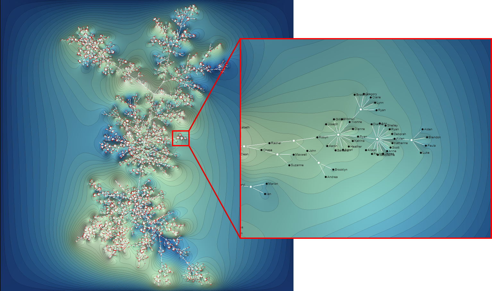
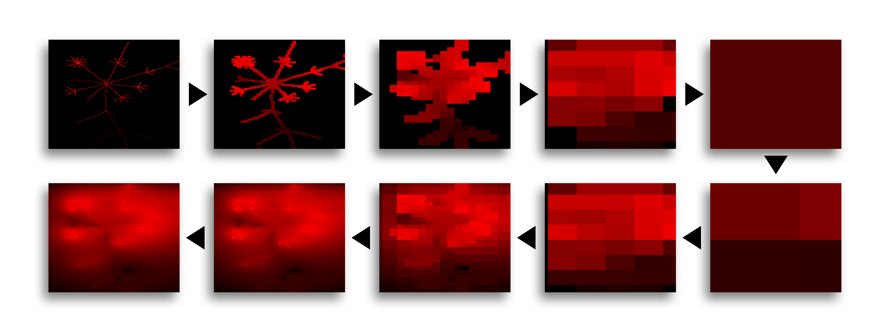
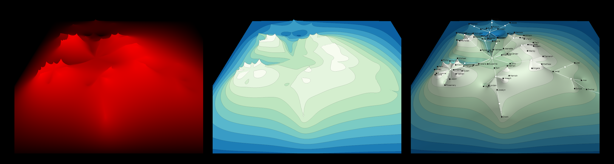

# 3D Topographic Attribute Map

> This work extends research done on Topographic Attribute Maps (TAM) by proposing an additional third dimension. In general, a TAM is calculated by using domain specific annotated values for each node in a graph. The solution presented in this thesis enhances the demonstration of the original work done on graphs, in the sense that it provides a technique to visualize the two-dimensional graph in a three-dimensional environment.

3D Topographic Attribute Maps (short TAM) extend 2D TAM by an additional dimension. This repository holds the code of the  WebApp developed in conjunction with the thesis on 3D Topographic Attribute Maps. 


<p align="center">
  
</p>


# Implementation

To achieve the final output several compute shader stages are run and the application is heavily reliant on WebGL 2.0 Compute (extension).

After successfully computing the layout the application calculates a smooth heightfield based on a hierachical diffusion algorithm that can be implemented efficiently on dedicated graphics hardware.

<p align="center">
  
</p>

Rendering is a two step process in which a post-proccessing algorithm converts the plain heightfield values on the mesh into more meaningful, user provided color information while applying lighting (via. Phong shading model).

<p align="center">
  
</p>


## Requirements:

#### Build requirements

Node v10.15.3


#### Build requirements

WebGL 2.0 Compute (extension) 

At the time of developing this application, only Chrome Beta (dev. on Version 84) had support for the extension.
For further details see https://github.com/9ballsyndrome/WebGL_Compute_shader.


## Building the application:

To build and serve the project use the following commands in the root directory.
(Next to package.json).

```
npm install
npm run watch
```

To run the application open ```localhost:4000``` and the page should be displayed properly.

The application source (TypeScript) is located under the ```src/``` directory.
After running ```npm run``` (or ```npm build```) the TypeScript source files are transpiled into the ```dist/``` directory
and further served by a webpack development server.